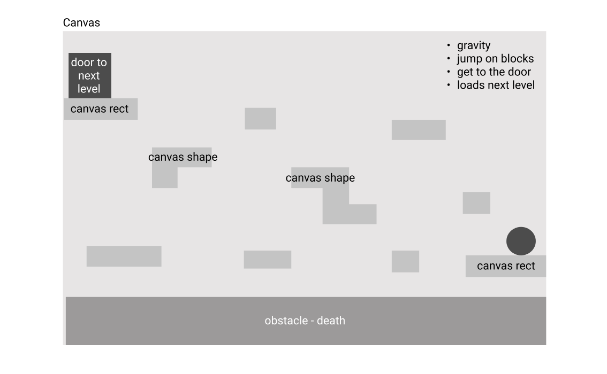
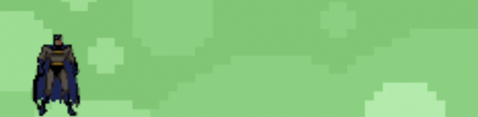
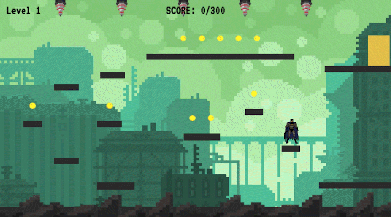
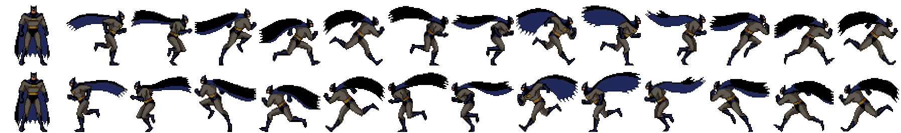

# Project 1: The Batgame

## Overview

The Batgame was my first solo project coding in JavaScript, but given that I have had some experience in the past, I decided to push the boundaries of the brief and create a platform game.

Platform games are a subgenre of action games that involve the player navigating to an end-goal through multiple levels and environments. Although it would be possible to create such a game using grid-based logic, I instead endeavoured to use HTML Canvas to render my game.

Given that Canvas had not been taught in the first three weeks of the course, this project required a great deal of research and extracurricular learning.


## Brief

Design a simple grid-based game using the JavaScript, HTML, and CSS knowledge learned in the first three weeks of the course. The project should be working and playable, involving basic game logic such as winning, losing, and scoring points.

Choices included: Space Invaders, Battleships, Frogger, and Snake.

## Deployment

Please follow this link to play The Batgame: https://ideens.github.io/platform-game/

## Technologies
- JavaScript
- HTML Canvas
- HTML5
- CSS
- VSCode
- Git
- GitHub
- Firefox Developer Edition
- Adobe Illustrator
- Adobe Photoshop

## Approach
### Planning
Before the start of the project I planned out some key sections and what steps I would take. The steps that I planned on completing to achieve my MVP are as follows:
- Create canvas inside HTMl
- Create all interacting elements (platforms, doors, obstacles)
- Player element (position, speed, jumping height, size)
- Make key listener (left, right, space)
- Apply gravity to the player + speed
- Turn off gravity when the player is on a platform (need to make sure position of the player is above the position of the platform before doing this)
- Set boundaries for the player (ground, walls)
- Create obstacles and check for collision
- I also created a wireframe to map out the rough location of the platforms and obstacles.



#### MVP
- One level with a door triggering something to mimic another level
- Movable player with jumps and platforms
- Onboarding screen and start button
- Winning / losing

#### Additional features
- Multiple levels
- Sound effects and audio
- Sprite animation

### Movement and Collision Detection
The first step was to implement the player's movement through key presses. To start, I just used a simple rectangle for the player and later moved onto using a sprite sheet. I implemented movement in the right, left, and upwards direction using event listeners on the arrow keys and spacebar. I then created several canvas rectangles to act as platforms in order to calculate and test the detection of collisions between them and the player.

```
function playerMovement(){
    if(keys["ArrowUp"] || keys[" "]) {
        //console.log("Up Key or Space Pressed")
        if(!player.jumping){
            player.velY = -player.jumpStrength*1.5
            player.jumping = true
        }
        jumpSound()
    }
    if(keys["ArrowRight"]) {
        //console.log("Right Key Pressed")
        player.position = "right"
        if(player.velX < player.speed){ //speed of player right
            player.velX++
            swooshSound()
        }
        
    }
    if(keys["ArrowLeft"]) {
        //console.log("Left Key Pressed")
        player.position = "left"
        if(player.velX > -player.speed){ //speed of player left
            player.velX--
            swooshSound()
        }
    }
    player.x += player.velX
    player.velX *= friction //friction for player to stop on keyup
    player.y += player.velY
    player.velY += gravity //increase gravity when jumped

    player.grounded = false

    // Looping through platforms to check for collisions
    for(let i = 0; i < platforms.length; i++){
        let direction = collisionDetection(player, platforms[i])
        //console.log(direction)
        
        if(direction === "left" || direction === "right"){
            player.velX = 0
        } else if (direction === "bottom") {
            player.jumping = false
            player.grounded = true
        } else if (direction === "top") {
            player.velY *= -1
        }
    }
    if (player.grounded) {
        player.velY = 0
    }
    //COLLIDING WITH THE DOOR
    if (collisionDetection(player, door) ){
        transitionSound()
        startNextLevel()
    } 
    //COLLIDING WITH THE GROUND
    if (collisionDetection(player, groundDeath)){
        deathSound()
        playerDied()
        console.log("DEAD")
    }
    
    if(!died && !completed){
    requestAnimationFrame(gameLoop)
    }
}
```

At first, in order to create the game loop, I was using setInterval, however in order to create a smoother loop with less flicker, I opted to use requestAnimationFrame. This produced a higher quality animation and enhanced the flow of the game.




For collision detection, I calculated the distance in the x axis between the objects colliding (e.g. player and platform), and got the sum of half of the widths of each of the objects. I did the same in the y axis and so the collision could be found with the difference between each object.

Once I was able to move the player, jump onto surfaces, fall, and collide with the walls, I then needed to think about how to enter another level. For this, I created a ‘door’ that would trigger the game to render the next level when the player collides with it.

I also applied the same logic to the ‘ground’. When the player collides with the canvas rectangle that is the ground, the player dies and the game restarts from the first level.





### Levels
Each of the levels are created in a different function, triggered when the player meets a door. In these functions, the player movement and collision remains the same, but what is rendered changes. Each of the levels render a different platform array, coins array, and door. Level 2 also involves obstacles that are called in the levelTwo function. 

The starting position of the player is also changed so that it does not remain in the same place that it ended up in the previous level. 

```
function levelOne(){
    clearCanvas()
    platforms = platformsLevelOne
    door = doorLevelOne
    startNextLevel = levelTwo
    coins = coinsLevelOne
    coinsReset()
    levelDisplay = "Level 1"
    laserAudio.pause()
    player.x = canvas.width - 50
    player.y = canvas.height - 129
    obstaclesArray =[]

}
```

In order for the next level to start, startNextLevel also had to be defined as the level after the function it was written in. For example in levelTwo, startNextLevel was made to equal levelThree so that when startNextLevel was called, the next level would correctly be level 3.

### Scoring
Each coin in the arrow of coins has a property called isAbsorbed. This is a boolean value that dictates whether the player has collided with the coin and therefore has consumed it and added its scores. When the coins are first defined, isAbsorbed is set to false as they should be displayed in their given positions, however when the player collides with the coin, isAbsored is set to true and ten points are added to the score.

```
function detectCoins(){
    coins.forEach((coin, index) => {
        if (coin.isAbsorbed){
            return
        }
        const dist = Math.hypot(coin.x - player.x-player.width/2, coin.y - player.y-player.height/2)
        //console.log(dist)
        if (dist < 26){
            score += 10
            coin.isAbsorbed = true
            collectSound()
        }
    })
}
```

### Sound Effects and Audio
To make the game more engaging, I also added various sound effects to the canvas such as jumping, winning, and losing sounds, as well as smaller touches such as the cape ‘whooshing’ and the sound of coins being collected. This added to the enjoyment of the game as the user is more immersed in it.

```
function jumpSound() {
    jumpAudio.src = "jump.wav"
    jumpAudio.volume = 0.2
    jumpAudio.play()
}
```

```
function playerMovement(){
    if(keys["ArrowUp"] || keys[" "]) {
        //console.log("Up Key or Space Pressed")
        if(!player.jumping){
            player.velY = -player.jumpStrength*1.5
            player.jumping = true
        }
        jumpSound()
    }
```

## Challenges
Creating the sprite animation was a bit of a challenge. To start, I created a spritesheet with only left and right facing poses and implemented them on key presses. However, this would not work with a complete sprite sheet as I would need to loop through the entire thing while the key is pressed. I found this difficult to wrap my head around but I soon figured out that the movement would not relate to key presses, but to the animation frame. 

Therefore, I created two arrays for each direction and populated them with the correct x coordinates of the sprite sheet. I then created a function to iterate through the array at a particular frame rate that I adjusted after testing the animation.

`const frame = Math.floor(timeStamp/80) % 13`



The sprite movement is not perfect, as you can see segments of the adjacent sprite in some frames, however I was very happy with the result and it worked very well in the game.


## Future Features
When asking friends and family to play the game, one of the main pieces of feedback I received was inclusion of a leaderboard. This would be an excellent feature as it would increase competition and therefore create better gameplay. To do this, I would most likely provide an input at the end for the game for the user’s name and store this along with their score to LocalStorage.

Given more time I would also add more levels and, with that, more obstacles and interesting new environments to give the sense of world-building. With more levels, I would also add checkpoints so that when a player dies in a later level, they can respawn from their last checkpoint as opposed to the very first level.


## Key Learnings
My key takeaway from this project is that everything in the game should be linked. One function triggers another and that sets off another function etc. Therefore, planning this ahead of the development phase would have streamlined the process and minimised any confusion of the timeline of game events. Creating a flowchart or diagram of key events in the game and how to get from one place to another would have definitely been a good idea if this game was much larger in scope and more complex.
